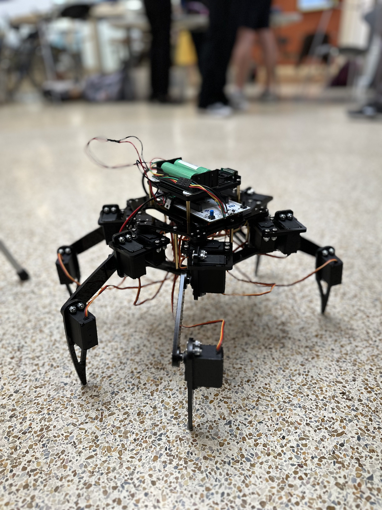
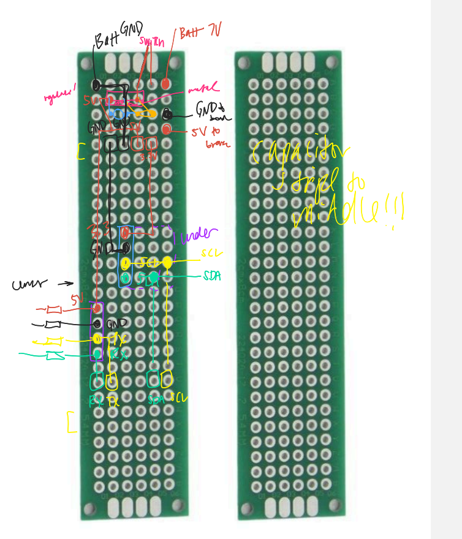
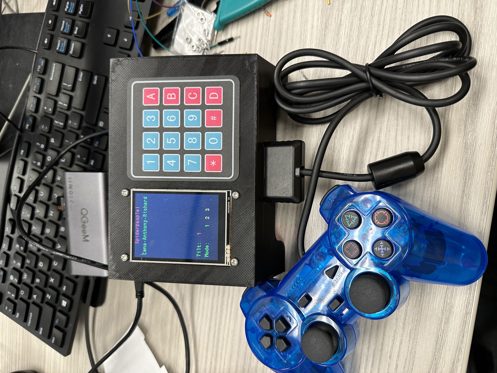
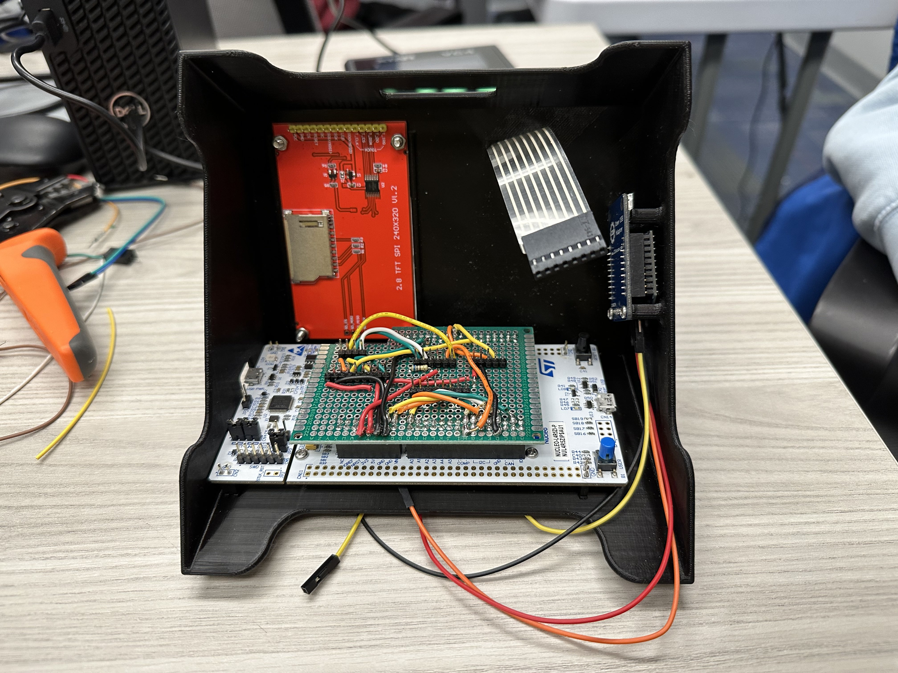

This repo houses a project a team and I designed for the University of Michigan Embedded Systems EXPO in 2024. 
[Check out the poster! (PDF)](Poster.pdf) 
Many remote controlled vehicles are cars with limited applicable environments and unsuited to rough terrain. Therefore we believe that there is room to explore various modes of movement which can advance the understanding of the capabilities and limitations of robot navigation in difficult terrains. Moreover, robots with novel mobility schemes are visually interesting and can inspire kids to learn more about robotics. 
With these goals, our project became a spider-like robot that is capable of basic movement such as turning around, walking forwards, backwards, etc. The robot is capable of dynamically changing its style of walk (for example switching from tripod walk, which is lifting three legs at a time, to ripple walk, which is lifting two legs at a time). 
The legs of the robot are controlled by servo motors and their movements use custom walking algorithms that manipulate each joint within each leg appropriately. 
We used an STM32 Nucleo as the board for the spider. The robot spider is then controlled using XBEEs and a PS2 handheld controller. An IMU on the spider can serve as an indicator of useful information, such as angle of tilt, so that users have a sense of when the spider might fall over even when they cannot see the robot. Additionally, the LCD screen displays the mode of walking and a keypad for the user to switch between these different walking modes. 

 
# Files
The folder "RemoteControlRobotSpider" includes the files to run on an STM32 Nucleo board. It contains the algorithms of the walking styles as well as how it communicates with the base station user. Wire connections to the hexapod will need to be made for the board to instruct the servos in the leg how to move which use I2C to be controlled. More wires will be needed to connect IMU functionality if desired.

The folder "BaseStation" contains the code run on another STM32 board that allows a user to control the robot spider using a PS2 controller. It also connects a keypad for users to switch walking modes, displayed on the LED screen, which the basestation polls.

Finally, the folder "CAD Files" contains the files to 3D print the container that houses the BaseStation electronics and wires.
